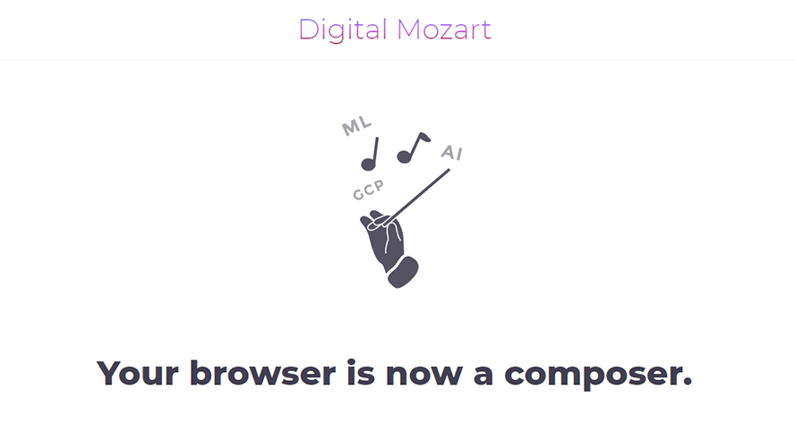

*"Digital Mozart is a next-gen AI-powered composer. It generates beautiful, thought-provoking tunes using an image you have provided as its source of inspiration. It is powered by Google® state-of-the-art image recognition algorithms, machine learning and modern browser API's."*

This is my project for Gofore Hackathon 2019. It composes purposely shitty tunes with premade samples and vocals generated by Google's Text-to-Speech API.

The backend first extracts labels from the source image using Cloud Vision API, then translates those labels to Finnish with Cloud Translation API and finally generates "vocals" with Cloud Text-to-Speech API, resulting in a horrible mess.

Techs used:
- Vue.js
- Docker
- Express
- Google's Cloud Translation API, Cloud Text-to-Speech API and Cloud Vision API
- Howler.js for music playback.

## Dependencies
- Docker
- Google Cloud Platform account.

## Project setup
1. Create a new project on Google Cloud Platform. Enable Cloud Translation API, Cloud Text-to-Speech API and Cloud Vision API
2. Generate a new service account key using Google Cloud Platform developer console
3. Place the service account key at project root and rename it to `.credentials.json`
4. Start the project with `docker-compose up --build`
5. Open `http://localhost:8065/` in browser.